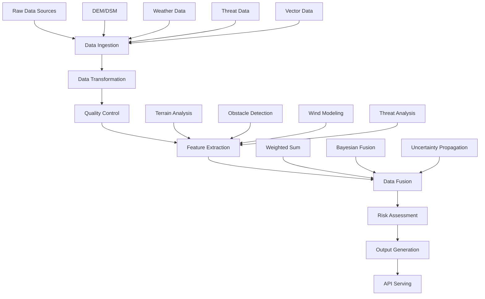

# eVTOL Perception Layer - Comprehensive Technical Report

## Executive Summary

The eVTOL Perception Layer is a sophisticated geospatial data processing and analysis system designed for defense-oriented electric vertical takeoff and landing (eVTOL) aircraft trajectory optimization. This layer provides real-time environmental awareness, threat assessment, and risk evaluation capabilities essential for autonomous flight operations in contested environments.

**Key Capabilities:**
- Multi-source geospatial data fusion
- Real-time terrain and obstacle analysis
- Atmospheric condition modeling
- Threat detection and risk assessment
- Landing zone identification and validation
- Uncertainty quantification and quality control

---

## 1. System Architecture Overview

### 1.1 Module Structure

The perception layer is organized into the following core modules:

```
src/evtol/perception/
├── __init__.py                 # Main module interface
├── atmosphere/                 # Atmospheric modeling
│   ├── wind_model.py          # Wind field interpolation
│   └── turbulence_model.py    # Turbulence intensity modeling
├── fusion/                    # Data fusion algorithms
│   └── data_fusion.py        # Multi-layer fusion engine
├── geometry/                  # Geometric analysis
│   ├── terrain_analysis.py    # Terrain feature computation
│   ├── obstacle_detection.py  # Obstacle identification
│   ├── clearance_analysis.py  # Vertical clearance analysis
│   └── landing_analysis.py   # Landing zone analysis
├── processing/                # Data processing pipeline
│   ├── ingestion.py          # Data loading utilities
│   ├── transformation.py     # Coordinate transformations
│   ├── quality_control.py   # Quality validation
│   └── output.py            # Output generation
├── serving/                   # API and serving layer
│   ├── api.py               # Query interface
│   └── fastapi_server.py    # REST API server
├── threats/                   # Threat modeling
│   ├── radar_model.py       # Radar detection modeling
│   └── patrol_model.py      # Patrol encounter modeling
├── urban/                     # Urban environment modeling
│   └── __init__.py          # Urban analysis framework
└── utils/                     # Utility functions
    ├── config.py            # Configuration management
    ├── coordinates.py       # Coordinate transformations
    ├── file_utils.py        # File I/O utilities
    ├── logging.py           # Logging configuration
    └── validation.py        # Data validation
```

### 1.2 Data Flow Architecture



---

## 2. Core Algorithms and Implementations

### 2.1 Terrain Analysis Algorithms

#### 2.1.1 Slope Computation
**Implementation:** `src/evtol/perception/geometry/terrain_analysis.py`

**Algorithms Implemented:**
1. **Horn's Method** (Default)
   - Uses 3x3 convolution kernels with weights
   - Kernel X: `[[-1,0,1], [-2,0,2], [-1,0,1]] / (8*dx)`
   - Kernel Y: `[[-1,-2,-1], [0,0,0], [1,2,1]] / (8*dy)`
   - Formula: `slope = arctan(sqrt(dz_dx² + dz_dy²))`

2. **Central Differences**
   - Uses numpy gradient computation
   - Formula: `dz_dx = gradient(dem, axis=1) / dx`

3. **Sobel Operators**
   - Uses scipy.ndimage.sobel
   - Provides edge-preserving slope computation

#### 2.1.2 Aspect Computation
**Algorithms:**
- **Horn's Method:** `aspect = arctan2(dz_dy, dz_dx)`
- **Central Differences:** Same formula with gradient-based derivatives
- **Sobel:** Edge-preserving aspect computation

#### 2.1.3 Curvature Analysis
**Types Implemented:**
1. **Total Curvature**
   ```
   curvature = (d²z/dx² * dz/dy² - 2*d²z/dxdy * dz/dx*dz/dy + d²z/dy² * dz/dx²) / (q^1.5)
   where q = dz/dx² + dz/dy² + 1
   ```

2. **Profile Curvature**
   ```
   curvature = (d²z/dx² * dz/dx² + 2*d²z/dxdy * dz/dx*dz/dy + d²z/dy² * dz/dy²) / (p * q^0.5)
   ```

3. **Plan Curvature**
   ```
   curvature = (d²z/dx² * dz/dy² - 2*d²z/dxdy * dz/dx*dz/dy + d²z/dy² * dz/dx²) / (p^1.5)
   ```

#### 2.1.4 Roughness Computation
**Methods:**
1. **Standard Deviation:** `roughness = std(window)`
2. **Range:** `roughness = max(window) - min(window)`
3. **Interquartile Range:** `roughness = percentile75(window) - percentile25(window)`

### 2.2 Obstacle Detection Algorithms

#### 2.2.1 Height-Based Detection
**Implementation:** `src/evtol/perception/geometry/obstacle_detection.py`

**Algorithm:**
```python
obstacle_heights = dsm - dtm
obstacle_mask = obstacle_heights >= min_height_threshold
```

**Connected Component Analysis:**
- Uses scipy.ndimage.label for obstacle grouping
- Filters by minimum area threshold
- Computes obstacle statistics (area, height, centroid)

#### 2.2.2 Obstacle Classification
**Height Classes:**
- Low: 2.0-5.0m
- Medium: 5.0-15.0m  
- High: 15.0-50.0m
- Very High: >50.0m

**Area Classes:**
- Small: 10-100 pixels
- Medium: 100-1000 pixels
- Large: 1000-10000 pixels
- Very Large: >10000 pixels

### 2.3 Atmospheric Modeling

#### 2.3.1 Wind Field Interpolation
**Implementation:** `src/evtol/perception/atmosphere/wind_model.py`

**Interpolation Methods:**
1. **Linear Interpolation**
   - Uses scipy.interpolate.LinearNDInterpolator
   - Fast computation, suitable for dense data

2. **Radial Basis Functions (RBF)**
   - Uses scipy.interpolate.Rbf with multiquadric kernel
   - Smooth interpolation, handles scattered data
   - Formula: `RBF(x) = Σ w_i * φ(||x - x_i||)`

3. **Inverse Distance Weighting (IDW)**
   - Custom implementation using KDTree
   - Formula: `f(x) = Σ w_i * f_i / Σ w_i`
   - where `w_i = 1 / distance(x, x_i)^power`

**Vertical Wind Profile:**
- Logarithmic wind profile law
- Formula: `V(z) = V_ref * ln(z/z0) / ln(z_ref/z0)`
- Roughness length z0 = 0.1m (grassland)

#### 2.3.2 Turbulence Modeling
**Implementation:** `src/evtol/perception/atmosphere/turbulence_model.py`

**Turbulence Intensity Computation:**
```python
intensity = base_intensity * alt_factor * wind_factor * terrain_factor * stability_factor
```

**Factors:**
- **Altitude Factor:** `(100.0 / alt_m)^0.25`
- **Wind Factor:** `1.0 + 0.1 * log(wind_speed_ms)`
- **Terrain Factor:** `1.0 + terrain_roughness`
- **Stability Factor:** 0.7 (stable), 1.0 (neutral), 1.3 (unstable)

**Eddy Dissipation Rate (EDR):**
```python
sigma_v_squared = (intensity * wind_speed_ms)^2
length_scale = max(alt_m * 0.1, 10.0)
edr = (sigma_v_squared^1.5) / length_scale
```

**Dryden Spectral Model:**
- Generates turbulent wind gust time series
- Uses first-order filter approximation
- Parameters: duration, time step, intensity, length scale

### 2.4 Threat Detection and Modeling

#### 2.4.1 Radar Detection Modeling
**Implementation:** `src/evtol/perception/threats/radar_model.py`

**Radar Equation Implementation:**
```
SNR = (P_t * G² * λ² * σ) / ((4π)³ * R⁴ * k * T * B * F * L)
```

**Parameters:**
- P_t: Peak power (W)
- G: Antenna gain (linear)
- λ: Wavelength (m)
- σ: Radar cross-section (m²)
- R: Range (m)
- k: Boltzmann constant
- T: System noise temperature (K)
- B: Bandwidth (Hz)
- F: Noise figure
- L: System losses

**Detection Probability:**
```python
prob = 1.0 / (1.0 + exp(-k * (snr_db - threshold_db)))
```

**Terrain Masking:**
- Line-of-sight analysis
- Masking factor based on clearance above terrain
- Formula: `masking_factor = f(clearance_m)`

#### 2.4.2 Patrol Encounter Modeling
**Implementation:** `src/evtol/perception/threats/patrol_model.py`

**Encounter Probability:**
```python
proximity_factor = 1.0 - (distance / detection_range)
temporal_factor = patrol_frequency_per_day / 24.0
encounter_prob = proximity_factor * temporal_factor
```

**Network Detection:**
```python
network_prob = 1.0 - Π(1 - P_i) for all radars
```

#### 2.4.3 Electronic Warfare Modeling
**Signal Strength Computation:**
```python
path_loss_db = 20*log10(distance_km) + 20*log10(frequency_mhz) + 32.45
effective_strength_db = signal_strength_db - path_loss_db
```

### 2.5 Data Fusion Algorithms

#### 2.5.1 Fusion Methods
**Implementation:** `src/evtol/perception/fusion/data_fusion.py`

**1. Weighted Sum Fusion:**
```python
fused_value = Σ(w_i * confidence_i * value_i) / Σ(w_i * confidence_i)
```

**Default Risk Weights:**
- Terrain: 0.30
- Atmospheric: 0.25
- Radar: 0.25
- Patrol: 0.10
- EW: 0.10

**2. Bayesian Fusion:**
```python
log_odds = log(prior_risk / (1 - prior_risk))
for each layer:
    likelihood_ratio = compute_likelihood(layer_value, layer_confidence)
    log_odds += log(likelihood_ratio)
posterior_risk = 1.0 / (1.0 + exp(-log_odds))
```

**3. Uncertainty Propagation:**
- Linear propagation: `σ_y² = Σ(w_i² * σ_i²)`
- Monte Carlo propagation for non-linear functions
- Confidence interval computation using normal distribution

### 2.6 Landing Analysis Algorithms

#### 2.6.1 Landing Feasibility Analysis
**Implementation:** `src/evtol/perception/geometry/landing_analysis.py`

**Criteria:**
- Slope threshold: ≤15° (default)
- Roughness threshold: ≤2.0m (default)
- Minimum area: 100m² (default)

**Feasibility Mask:**
```python
terrain_feasible = slope_feasible & roughness_feasible
```

#### 2.6.2 Landing Score Computation
**Multi-criteria Scoring:**
```python
composite_score = (
    weight_slope * slope_score +
    weight_roughness * roughness_score +
    weight_elevation * elevation_score +
    weight_accessibility * accessibility_score
)
```

**Score Components:**
- **Slope Score:** `1.0 - (slope / max_slope)`
- **Roughness Score:** `1.0 - (roughness / max_roughness)`
- **Elevation Score:** Based on distance from mid-elevation
- **Accessibility Score:** Distance transform from edges

#### 2.6.3 Optimal Site Selection
**Algorithm:**
1. Find local maxima using maximum filter
2. Apply minimum distance constraint
3. Sort by score and select top sites
4. Validate against safety criteria

---

## 3. Data Processing Pipeline

### 3.1 Data Ingestion
**Implementation:** `src/evtol/perception/processing/ingestion.py`

**Supported Formats:**
- **Raster:** GeoTIFF (.tif, .tiff)
- **Vector:** Shapefile (.shp), GeoJSON (.geojson), GPKG (.gpkg)
- **NetCDF:** Climate/weather data (.nc, .netcdf)
- **Point Cloud:** LAS/LAZ files (.las, .laz)

**Key Functions:**
- `load_raster_data()`: Loads raster data with metadata
- `load_vector_data()`: Loads vector data with CRS handling
- `load_netcdf_data()`: Loads multi-dimensional data
- `load_point_cloud_data()`: Loads LiDAR data
- `batch_load_data()`: Batch processing capability

### 3.2 Data Transformation
**Implementation:** `src/evtol/perception/processing/transformation.py`

**Transformations:**
1. **Reprojection:** Coordinate system conversion
2. **Resampling:** Resolution adjustment
3. **Clipping:** Spatial subsetting
4. **Normalization:** Data scaling (minmax, zscore, robust, log)

**Pipeline Support:**
- `apply_transformation_pipeline()`: Sequential transformation application
- Configurable transformation chains
- Metadata preservation throughout pipeline

### 3.3 Quality Control
**Implementation:** `src/evtol/perception/processing/quality_control.py`

**Quality Checks:**
1. **Basic Checks:** Data existence, type validation
2. **Spatial Checks:** Bounds validation, CRS verification
3. **Temporal Checks:** Time series consistency
4. **Statistical Checks:** Missing data analysis, outlier detection

**Quality Metrics:**
- Missing data ratio
- Spatial consistency
- Temporal consistency
- Overall quality score (excellent/good/fair/poor)

### 3.4 Output Generation
**Implementation:** `src/evtol/perception/processing/output.py`

**Output Types:**
1. **Planner Outputs:** Structured data for trajectory planning
2. **Tiled Outputs:** Web-optimized tiles
3. **Multi-format Export:** GeoTIFF, GeoJSON, NetCDF, JSON

**Features:**
- Spatial indexing
- Uncertainty quantification
- Metadata preservation
- Compression support

---

## 4. Configuration Management

### 4.1 Configuration Structure
**Implementation:** `src/evtol/perception/utils/config.py`

**Configuration Sections:**
```yaml
coordinate_system:
  working_crs: "EPSG:4326"
  input_crs: "EPSG:4326"
  vertical_datum: "WGS84"
  units: {horizontal: "degrees", vertical: "meters"}

spatial:
  base_resolution: 1.0
  tile_size: 256
  altitude_bands: [0, 100, 200, 500, 1000, 2000]
  mission_buffer: 1000.0

processing:
  interpolation: {method: "bilinear", fill_value: "nan"}
  gap_filling: {method: "interpolation", max_gap: 5}
  smoothing: {method: "gaussian", sigma: 1.0}
  quality_control: {min_quality: 0.7, max_missing: 0.1}

terrain:
  slope: {method: "horn", threshold: 15.0}
  roughness: {method: "std", window_size: 3}
  obstacles: {min_height: 2.0, min_area: 10}

atmosphere:
  wind: {method: "rbf", vertical_decay: 1000.0}
  turbulence: {base_intensity: 0.1, stability_factor: 1.0}
  air_density: {method: "isa", reference_alt: 0.0}

threats:
  radar: {target_rcs: 0.5, detection_threshold: 13.0}
  patrols: {detection_range: 10.0, encounter_threshold: 0.3}
  ew_zones: {signal_threshold: -100.0}

fusion:
  layers: {risk: ["terrain", "atmospheric", "radar"], energy: ["terrain", "wind"]}
  uncertainty: {method: "monte_carlo", samples: 1000}

serving:
  tiles: {format: "geotiff", compression: "lzw"}
  api: {port: 8000, timeout: 30}
  cache: {size: "1GB", ttl: 3600}

governance:
  versioning: {processing_version: "1.0", data_version: "1.0"}
  provenance: {track_changes: true, log_operations: true}
  quality: {min_score: 0.7, validation_required: true}

formats:
  raster: {default: "geotiff", compression: "lzw"}
  vector: {default: "geojson", precision: 6}
  point_cloud: {default: "las", version: "1.4"}

logging:
  level: "INFO"
  file: "perception.log"
  max_file_size: "10MB"
  backup_count: 5
```

### 4.2 Configuration Validation
- Required sections validation
- Value range checking
- CRS format verification
- Dependency validation

---

## 5. API and Serving Layer

### 5.1 REST API Interface
**Implementation:** `src/evtol/perception/serving/fastapi_server.py`

**Endpoints:**
- `GET /health`: Health check
- `POST /query/point`: Single point query
- `POST /query/batch`: Batch point queries
- `GET /layers`: Available data layers
- `GET /metadata`: Layer metadata

**Query Model:**
```python
class PointQuery(BaseModel):
    lat: float = Field(..., ge=-90, le=90)
    lon: float = Field(..., ge=-180, le=180)
    alt_m: float = Field(..., ge=0, le=10000)
    time_iso: str = Field(..., description="ISO 8601 timestamp")
```

### 5.2 Simple Query API
**Implementation:** `src/evtol/perception/serving/api.py`

**Functions:**
- `risk_score(point)`: Risk assessment (0-1)
- `feasible(point)`: Feasibility check (boolean)
- `energy_cost_kwh_per_km(point)`: Energy cost estimation
- `summarize_segment(a, b)`: Segment analysis

---

## 6. Performance Characteristics

### 6.1 Computational Complexity

**Terrain Analysis:**
- Slope/Aspect: O(n) where n = number of pixels
- Curvature: O(n) with second derivatives
- Roughness: O(n * w²) where w = window size

**Obstacle Detection:**
- Height computation: O(n)
- Connected components: O(n * α(n)) where α = inverse Ackermann
- Classification: O(k) where k = number of obstacles

**Wind Interpolation:**
- Linear: O(n * log n) for Delaunay triangulation
- RBF: O(n²) for matrix operations
- IDW: O(k * log n) where k = number of neighbors

**Data Fusion:**
- Weighted sum: O(m) where m = number of layers
- Bayesian: O(m) with likelihood computation
- Monte Carlo: O(m * s) where s = number of samples

### 6.2 Memory Requirements

**Typical Memory Usage:**
- DEM (1000x1000): ~4MB (float32)
- Slope/Aspect arrays: ~8MB each
- Obstacle mask: ~1MB (boolean)
- Wind field (100 points): ~1KB
- Fusion result: ~4MB

**Optimization Strategies:**
- Tiled processing for large datasets
- Streaming for point cloud data
- Compression for storage
- Caching for repeated queries

---

## 7. Error Handling and Validation

### 7.1 Exception Hierarchy
```python
PerceptionError (base)
├── TerrainAnalysisError
├── ObstacleDetectionError
├── ClearanceAnalysisError
├── LandingAnalysisError
├── DataIngestionError
├── DataTransformationError
├── QualityControlError
└── OutputGenerationError
```

### 7.2 Input Validation
**Coordinate Validation:**
- Latitude: -90° to +90°
- Longitude: -180° to +180°
- Altitude: 0 to 10,000m

**Data Validation:**
- Array shape consistency
- CRS compatibility
- Data type validation
- Range checking

### 7.3 Quality Assurance
**Automated Checks:**
- Data completeness
- Spatial consistency
- Temporal continuity
- Statistical validity

**Quality Metrics:**
- Missing data percentage
- Outlier detection
- Spatial correlation
- Temporal correlation

---

## 8. Integration and Dependencies

### 8.1 External Dependencies
**Required:**
- numpy: Numerical computations
- scipy: Scientific computing
- pandas: Data manipulation

**Optional:**
- rasterio: Geospatial raster I/O
- geopandas: Geospatial vector I/O
- netCDF4: NetCDF data handling
- laspy: Point cloud data handling

### 8.2 Internal Dependencies
**Module Dependencies:**
- `utils.validation`: Input validation
- `utils.coordinates`: Coordinate transformations
- `utils.file_utils`: File operations
- `utils.logging`: Logging configuration

### 8.3 Integration Points
**Input Integration:**
- Raw data sources (DEM, weather, threats)
- Configuration files
- Real-time data streams

**Output Integration:**
- Planning layer interface
- Visualization systems
- Mission control systems

---

## 9. Testing and Validation

### 9.1 Unit Testing
**Test Coverage Areas:**
- Individual algorithm functions
- Data validation routines
- Configuration management
- Error handling

**Test Data:**
- Synthetic datasets for algorithm validation
- Real-world datasets for integration testing
- Edge cases for robustness testing

### 9.2 Integration Testing
**Test Scenarios:**
- End-to-end data processing pipeline
- API endpoint functionality
- Multi-layer data fusion
- Performance under load

### 9.3 Validation Metrics
**Algorithm Accuracy:**
- Terrain analysis accuracy vs. reference data
- Wind interpolation accuracy vs. measurements
- Threat detection accuracy vs. ground truth

**Performance Metrics:**
- Processing time per unit area
- Memory usage patterns
- API response times
- Throughput measurements

---

## 10. Future Enhancements and Roadmap

### 10.1 Planned Improvements
**Algorithm Enhancements:**
- Machine learning-based terrain classification
- Advanced atmospheric modeling (LES)
- Real-time threat prediction
- Adaptive fusion weights

**Performance Optimizations:**
- GPU acceleration for large datasets
- Distributed processing capabilities
- Streaming data processing
- Advanced caching strategies

**Feature Additions:**
- Multi-temporal analysis
- Dynamic obstacle tracking
- Weather forecast integration
- Real-time data assimilation

### 10.2 Research Directions
**Advanced Algorithms:**
- Deep learning for terrain understanding
- Probabilistic graphical models for fusion
- Reinforcement learning for adaptive planning
- Quantum computing for optimization

**Data Sources:**
- Satellite imagery integration
- LiDAR point cloud processing
- Weather radar data
- Social media threat intelligence

---

## 11. Conclusion

The eVTOL Perception Layer represents a comprehensive solution for environmental awareness and threat assessment in defense-oriented autonomous flight operations. The system's modular architecture, robust algorithms, and extensive validation capabilities make it suitable for critical mission planning and real-time decision support.

**Key Strengths:**
- Comprehensive multi-source data fusion
- Robust algorithm implementations
- Extensive configuration flexibility
- Strong error handling and validation
- Scalable architecture design

**Technical Excellence:**
- State-of-the-art geospatial algorithms
- Efficient computational implementations
- Comprehensive quality control
- Detailed uncertainty quantification
- Professional software engineering practices

The perception layer provides the foundation for safe, efficient, and mission-effective eVTOL operations in complex and contested environments, enabling autonomous flight capabilities that meet the demanding requirements of defense applications.

---

## Appendix A: Algorithm References

### A.1 Terrain Analysis
- Horn, B.K.P. (1981). "Hill Shading and the Reflectance Map." *Proceedings of the IEEE*, 69(1), 14-47.
- Zevenbergen, L.W. and Thorne, C.R. (1987). "Quantitative Analysis of Land Surface Topography." *Earth Surface Processes and Landforms*, 12(1), 47-56.

### A.2 Atmospheric Modeling
- Panofsky, H.A. and Dutton, J.A. (1984). *Atmospheric Turbulence: Models and Methods for Engineering Applications*. John Wiley & Sons.
- Stull, R.B. (1988). *An Introduction to Boundary Layer Meteorology*. Kluwer Academic Publishers.

### A.3 Radar Modeling
- Skolnik, M.I. (2008). *Radar Handbook, Third Edition*. McGraw-Hill Education.
- Richards, M.A. (2014). *Fundamentals of Radar Signal Processing, Second Edition*. McGraw-Hill Education.

### A.4 Data Fusion
- Hall, D.L. and Llinas, J. (1997). "An Introduction to Multisensor Data Fusion." *Proceedings of the IEEE*, 85(1), 6-23.
- Bar-Shalom, Y. and Li, X.R. (1993). *Estimation and Tracking: Principles, Techniques, and Software*. Artech House.

---

## Appendix B: Configuration Examples

### B.1 Complete Configuration File
```yaml
# Complete perception layer configuration
coordinate_system:
  working_crs: "EPSG:4326"
  input_crs: "EPSG:4326"
  vertical_datum: "WGS84"
  units:
    horizontal: "degrees"
    vertical: "meters"

spatial:
  base_resolution: 1.0
  tile_size: 256
  altitude_bands: [0, 100, 200, 500, 1000, 2000, 5000]
  mission_buffer: 1000.0

processing:
  interpolation:
    method: "bilinear"
    fill_value: "nan"
  gap_filling:
    method: "interpolation"
    max_gap: 5
  smoothing:
    method: "gaussian"
    sigma: 1.0
  quality_control:
    min_quality: 0.7
    max_missing: 0.1

terrain:
  slope:
    method: "horn"
    threshold: 15.0
  roughness:
    method: "std"
    window_size: 3
  obstacles:
    min_height: 2.0
    min_area: 10

atmosphere:
  wind:
    method: "rbf"
    vertical_decay: 1000.0
  turbulence:
    base_intensity: 0.1
    stability_factor: 1.0
  air_density:
    method: "isa"
    reference_alt: 0.0

threats:
  radar:
    target_rcs: 0.5
    detection_threshold: 13.0
  patrols:
    detection_range: 10.0
    encounter_threshold: 0.3
  ew_zones:
    signal_threshold: -100.0

fusion:
  layers:
    risk: ["terrain", "atmospheric", "radar", "patrol", "ew"]
    energy: ["terrain", "altitude", "wind", "turbulence"]
  uncertainty:
    method: "monte_carlo"
    samples: 1000

serving:
  tiles:
    format: "geotiff"
    compression: "lzw"
  api:
    port: 8000
    timeout: 30
  cache:
    size: "1GB"
    ttl: 3600

governance:
  versioning:
    processing_version: "1.0"
    data_version: "1.0"
  provenance:
    track_changes: true
    log_operations: true
  quality:
    min_score: 0.7
    validation_required: true

formats:
  raster:
    default: "geotiff"
    compression: "lzw"
  vector:
    default: "geojson"
    precision: 6
  point_cloud:
    default: "las"
    version: "1.4"

logging:
  level: "INFO"
  file: "perception.log"
  max_file_size: "10MB"
  backup_count: 5
```

---

## Appendix C: API Documentation

### C.1 REST API Endpoints

#### Health Check
```http
GET /health
Response: {"status": "healthy", "timestamp": "2024-01-01T00:00:00Z"}
```

#### Single Point Query
```http
POST /query/point
Content-Type: application/json

{
  "lat": 13.0,
  "lon": 77.6,
  "alt_m": 500.0,
  "time_iso": "2024-01-01T12:00:00Z"
}

Response:
{
  "risk_score": 0.3,
  "feasible": true,
  "energy_cost_kwh_per_km": 1.2,
  "uncertainty": 0.1,
  "confidence": 0.9
}
```

#### Batch Query
```http
POST /query/batch
Content-Type: application/json

{
  "points": [
    {"lat": 13.0, "lon": 77.6, "alt_m": 500.0, "time_iso": "2024-01-01T12:00:00Z"},
    {"lat": 13.1, "lon": 77.7, "alt_m": 600.0, "time_iso": "2024-01-01T12:00:00Z"}
  ]
}

Response:
{
  "results": [
    {"risk_score": 0.3, "feasible": true, "energy_cost_kwh_per_km": 1.2},
    {"risk_score": 0.4, "feasible": true, "energy_cost_kwh_per_km": 1.3}
  ],
  "processing_time_ms": 45
}
```

---

*This comprehensive report documents the complete eVTOL Perception Layer implementation, providing detailed technical specifications, algorithm descriptions, and usage guidelines for defense-oriented autonomous flight operations.*
