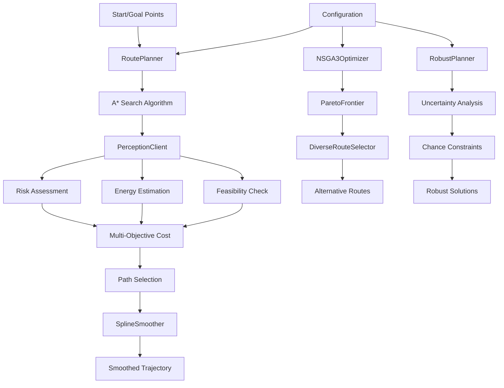

# eVTOL Planning Layer Comprehensive Technical Report

## Executive Summary

The eVTOL Planning Layer provides comprehensive trajectory optimization and route planning capabilities for eVTOL aircraft. This layer integrates advanced pathfinding algorithms, multi-objective optimization, robust planning under uncertainty, and trajectory smoothing to generate optimal flight paths that balance multiple competing objectives including time, energy consumption, and risk.

## Table of Contents

1. [System Architecture](#system-architecture)
2. [Core Components](#core-components)
3. [Mathematical Models and Algorithms](#mathematical-models-and-algorithms)
4. [Data Structures](#data-structures)
5. [Configuration Management](#configuration-management)
6. [API and Integration](#api-and-integration)
7. [Performance Characteristics](#performance-characteristics)
8. [Error Handling and Validation](#error-handling-and-validation)
9. [Testing and Validation](#testing-and-validation)
10. [Future Enhancements](#future-enhancements)

## System Architecture

### Module Structure

The planning layer is organized into the following main modules:

```
src/evtol/planning/
├── __init__.py                 # Main package interface
├── cli.py                      # Command-line interface
├── config.py                   # Configuration management
├── logging.py                  # Logging configuration
├── types.py                    # Type definitions
├── routing/                    # Pathfinding and routing
│   ├── planner.py             # A* route planner
│   ├── graph_router.py        # Graph-based routing
│   └── __init__.py
├── optimization/               # Multi-objective optimization
│   ├── nsga3.py               # NSGA-III algorithm
│   ├── pareto.py              # Pareto frontier computation
│   └── __init__.py
├── energy/                     # Energy optimization
│   ├── optimizer.py           # Energy estimation and optimization
│   └── __init__.py
├── risk/                       # Risk assessment
│   ├── assessment.py          # Risk evaluation and management
│   └── __init__.py
├── robust/                     # Robust planning under uncertainty
│   ├── uncertainty_planning.py # Chance-constrained optimization
│   └── __init__.py
├── smoothing/                  # Trajectory smoothing
│   ├── spline_smoother.py     # Spline-based trajectory smoothing
│   └── __init__.py
├── constraints/                # Flight constraints
│   ├── flight_constraints.py  # Dynamic feasibility constraints
│   └── __init__.py
├── mission/                    # Mission planning
│   ├── planning.py            # Mission-level orchestration
│   └── __init__.py
├── serving/                    # API and integration
│   ├── perception_client.py   # Perception layer integration
│   └── __init__.py
└── utils/                      # Utilities
    └── coordinates.py         # Coordinate transformations
```

### Data Flow Architecture



## Core Components

### 1. RoutePlanner (A* Pathfinding)

**Purpose**: Primary pathfinding engine using A* algorithm with multi-objective optimization.

**Key Features**:
- A* search with admissible heuristics
- Multi-objective cost function (distance, energy, risk, time)
- 8-connected grid expansion
- Constraint-aware pathfinding
- Path smoothing integration

**Core Algorithms**:
- **A* Search**: `f(n) = g(n) + h(n)` where g is actual cost and h is heuristic
- **Multi-objective Cost**: Weighted combination of multiple objectives
- **Haversine Distance**: Great-circle distance calculation
- **Path Smoothing**: Moving average smoothing

**Mathematical Formulation**:
```python
# A* node evaluation
f_cost = g_cost + h_cost

# Multi-objective edge cost
total_cost = (
    weight_distance * distance_cost +
    weight_energy * energy_cost +
    weight_risk * risk_cost +
    weight_time * time_cost
)

# Heuristic function (admissible)
h_cost = haversine_distance(current, goal) * min_cost_weight

# Haversine distance calculation
R = 6371.0  # Earth radius in km
dlat = radians(lat2 - lat1)
dlon = radians(lon2 - lon1)
a = sin(dlat/2)**2 + cos(radians(lat1)) * cos(radians(lat2)) * sin(dlon/2)**2
c = 2 * atan2(sqrt(a), sqrt(1-a))
distance = R * c
```

### 2. GraphRoutePlanner (NetworkX-based Routing)

**Purpose**: Graph-based routing using NetworkX for alternative route generation.

**Key Features**:
- Grid-based graph construction
- k-shortest paths computation
- Alternative route generation
- NetworkX integration
- Configurable grid resolution

**Core Algorithms**:
- **Graph Construction**: 8-neighborhood connectivity
- **k-Shortest Paths**: Yen's algorithm implementation
- **Edge Weight Calculation**: Multi-objective cost function
- **Grid Discretization**: Configurable resolution

**Mathematical Formulation**:
```python
# Graph construction
G = nx.Graph()
for point in grid_points:
    G.add_node(point)

# 8-neighborhood connectivity
directions = [(-1,-1), (-1,0), (-1,1), (0,-1), (0,1), (1,-1), (1,0), (1,1)]
for direction in directions:
    neighbor = current_point + direction
    if neighbor in grid_points:
        cost = compute_edge_cost(current_point, neighbor)
        G.add_edge(current_point, neighbor, weight=cost)

# k-shortest paths
paths = nx.shortest_simple_paths(G, start, goal, weight="weight")
```

### 3. NSGA3Optimizer (Many-Objective Optimization)

**Purpose**: Advanced multi-objective optimization using NSGA-III algorithm.

**Key Features**:
- Reference point generation (Das and Dennis method)
- Non-dominated sorting
- Environmental selection
- Convergence analysis
- Many-objective support (3+ objectives)

**Core Algorithms**:
- **NSGA-III**: Reference point-based selection
- **Non-dominated Sorting**: Pareto dominance ranking
- **Reference Point Generation**: Das and Dennis method
- **Environmental Selection**: Diversity preservation

**Mathematical Formulation**:
```python
# Reference point generation (Das and Dennis)
def das_dennis_method(num_objectives):
    # Generate points on unit simplex
    points = []
    for i in range(population_size):
        point = np.random.dirichlet(np.ones(num_objectives))
        points.append(ReferencePoint(position=point, weight=1.0/population_size))
    return points

# Non-dominated sorting
def non_dominated_sorting(solutions):
    fronts = []
    remaining = solutions.copy()
    
    while remaining:
        current_front = []
        dominated = []
        
        for i, sol_i in enumerate(remaining):
            is_dominated = False
            for j, sol_j in enumerate(remaining):
                if i != j and sol_j.dominates(sol_i):
                    is_dominated = True
                    break
            
            if not is_dominated:
                current_front.append(sol_i)
            else:
                dominated.append(sol_i)
        
        fronts.append(current_front)
        remaining = dominated
    
    return fronts

# Environmental selection
def environmental_selection(fronts, population_size):
    selected = []
    for front in fronts:
        if len(selected) + len(front) <= population_size:
            selected.extend(front)
        else:
            remaining_slots = population_size - len(selected)
            selected_from_front = select_from_front(front, remaining_slots)
            selected.extend(selected_from_front)
            break
    return selected
```

### 4. RobustPlanner (Uncertainty-Aware Planning)

**Purpose**: Robust planning under uncertainty using chance-constrained optimization.

**Key Features**:
- Chance-constrained optimization
- Monte Carlo simulation
- Value at Risk (VaR) computation
- Conditional Value at Risk (CVaR)
- Adaptive uncertainty budgets

**Core Algorithms**:
- **Chance Constraints**: `P(X ≤ threshold) ≥ α`
- **Monte Carlo Simulation**: Statistical sampling
- **VaR Calculation**: `VaR_α = μ + z_α * σ`
- **CVaR Calculation**: Expected value in worst α% cases

**Mathematical Formulation**:
```python
# Chance constraint deterministic equivalent
def chance_constrained_cost(cost_param, constraint):
    z_score = stats.norm.ppf(constraint.confidence_level)
    upper_bound = cost_param.mean + z_score * cost_param.std
    
    if upper_bound > constraint.threshold:
        penalty = (upper_bound - constraint.threshold) * 10.0
        return penalty
    return 0.0

# Value at Risk
def compute_value_at_risk(cost_param, percentile=0.95):
    z_score = stats.norm.ppf(percentile)
    var = cost_param.mean + z_score * cost_param.std
    return var

# Conditional Value at Risk
def compute_conditional_value_at_risk(cost_param, percentile=0.95):
    z_score = stats.norm.ppf(percentile)
    phi_z = stats.norm.pdf(z_score)
    cvar = cost_param.mean + (phi_z / (1 - percentile)) * cost_param.std
    return cvar

# Monte Carlo robustness evaluation
def evaluate_route_robustness(route_params, constraints):
    violations = {c.constraint_type: 0 for c in constraints}
    
    for i in range(monte_carlo_samples):
        for constraint in constraints:
            param_value = samples[constraint.constraint_type][i]
            if param_value > constraint.threshold:
                violations[constraint.constraint_type] += 1
    
    violation_rates = {
        constraint_type: count / monte_carlo_samples
        for constraint_type, count in violations.items()
    }
    
    overall_robustness = 1.0
    for constraint in constraints:
        satisfaction_rate = 1.0 - violation_rates[constraint.constraint_type]
        overall_robustness *= satisfaction_rate
    
    return {
        "overall_robustness": overall_robustness,
        "violation_rates": violation_rates
    }
```

### 5. SplineSmoother (Trajectory Smoothing)

**Purpose**: Smooth trajectory generation with curvature constraints and time parameterization.

**Key Features**:
- B-spline smoothing
- Curvature constraint enforcement
- Time-optimal parameterization
- Minimum snap trajectories
- C² continuity

**Core Algorithms**:
- **B-spline Fitting**: `splprep` and `splev` from scipy
- **Curvature Calculation**: Three-point curvature approximation
- **Time Parameterization**: Distance-based time assignment
- **Minimum Snap**: Fourth derivative minimization

**Mathematical Formulation**:
```python
# B-spline fitting
tck, u = splprep([lats, lons, alts], s=smoothing_factor, k=spline_degree)
u_new = np.linspace(0, 1, num_points)
smooth_coords = splev(u_new, tck)

# Curvature calculation (three-point method)
def compute_curvature_3points(p1, p2, p3):
    v1 = np.array([p2.lat - p1.lat, p2.lon - p1.lon])
    v2 = np.array([p3.lat - p2.lat, p3.lon - p2.lon])
    
    d1 = np.linalg.norm(v1)
    d2 = np.linalg.norm(v2)
    
    cos_theta = np.dot(v1, v2) / (d1 * d2)
    theta = np.arccos(np.clip(cos_theta, -1.0, 1.0))
    
    d_avg = (d1 + d2) / 2
    curvature = 2 * abs(np.sin(theta)) / d_avg if d_avg > 0 else 0.0
    
    return curvature

# Time parameterization
def time_parameterize(trajectory, cruise_speed_ms=35.0):
    trajectory[0].time_s = 0.0
    current_time = 0.0
    
    for i in range(1, len(trajectory)):
        prev = trajectory[i-1]
        curr = trajectory[i]
        
        distance_m = haversine_m(prev.lat, prev.lon, curr.lat, curr.lon)
        time_increment = distance_m / cruise_speed_ms
        current_time += time_increment
        curr.time_s = current_time
    
    return trajectory
```

### 6. EnergyOptimizer (Energy Management)

**Purpose**: Energy estimation and optimization for route planning.

**Key Features**:
- Distance-weighted energy calculation
- Battery reserve enforcement
- Perception layer integration
- Energy cost per kilometer estimation

**Core Algorithms**:
- **Energy Estimation**: `E_total = Σ(E_per_km * distance_km)`
- **Reserve Management**: Usable energy = capacity * (1 - reserve_fraction)
- **Distance Calculation**: Haversine formula

**Mathematical Formulation**:
```python
def estimate_route_energy(route, time_iso=None):
    capacity_kwh = config.get("energy.battery_capacity_kwh", 120.0)
    reserve_frac = config.get("energy.reserve_fraction", 0.15)
    usable_kwh = capacity_kwh * (1.0 - reserve_frac)
    
    total_energy_kwh = 0.0
    for a, b in zip(route[:-1], route[1:]):
        d_km = haversine_km(a.lat, a.lon, b.lat, b.lon)
        
        # Query perception for energy cost
        result = perception.query(a.lat, a.lon, a.alt_m, time_iso)
        e_per_km = result.energy_cost_kwh_per_km
        
        total_energy_kwh += e_per_km * d_km
        
        if total_energy_kwh >= usable_kwh:
            return usable_kwh
    
    return min(total_energy_kwh, usable_kwh)
```

### 7. RiskManager (Risk Assessment)

**Purpose**: Risk evaluation and emergency planning for routes.

**Key Features**:
- Distance-weighted risk calculation
- Risk score aggregation
- Emergency contingency planning
- Perception layer integration

**Core Algorithms**:
- **Risk Aggregation**: `avg_risk = Σ(risk * distance) / Σ(distance)`
- **Risk Limiting**: Cap at maximum allowed risk score
- **Contingency Planning**: Emergency divert routes

**Mathematical Formulation**:
```python
def evaluate_route_risk(route, time_iso=None):
    total_risk_distance = 0.0
    total_distance_km = 0.0
    
    for a, b in zip(route[:-1], route[1:]):
        result = perception.query(a.lat, a.lon, a.alt_m, time_iso)
        risk = result.risk_score
        
        d_km = haversine_km(a.lat, a.lon, b.lat, b.lon)
        total_risk_distance += risk * d_km
        total_distance_km += d_km
    
    if total_distance_km <= 0.0:
        return 0.0
    
    avg_risk = total_risk_distance / total_distance_km
    max_risk = config.get("risk.max_risk_score", 0.7)
    
    return min(avg_risk, max_risk)
```

### 8. FlightConstraintChecker (Constraint Validation)

**Purpose**: Dynamic feasibility constraint checking for eVTOL flight planning.

**Key Features**:
- Turn radius constraints
- Climb/descent rate limits
- Speed and acceleration bounds
- Payload capacity checks
- Altitude limits

**Core Algorithms**:
- **Turn Radius**: `R_min = V² / (g * tan(φ_max))`
- **Load Factor**: `n = 1 + a/g`
- **Climb Rate**: Vertical velocity limits
- **Speed Limits**: Min/max/maneuvering speeds

**Mathematical Formulation**:
```python
@dataclass
class VehicleConstraints:
    # Speed limits (m/s)
    min_speed_ms: float = 5.0
    max_speed_ms: float = 60.0
    cruise_speed_ms: float = 35.0
    
    # Acceleration limits (m/s²)
    max_acceleration_ms2: float = 3.0
    max_deceleration_ms2: float = 5.0
    
    # Turn performance
    max_bank_angle_deg: float = 45.0
    min_turn_radius_m: float = 50.0
    max_turn_rate_dps: float = 30.0
    
    # Vertical performance
    max_climb_rate_ms: float = 8.0
    max_descent_rate_ms: float = 6.0
    
    # Altitude limits (m)
    min_altitude_agl_m: float = 50.0
    max_altitude_asl_m: float = 5000.0
    
    # Payload constraints (kg)
    max_payload_kg: float = 600.0
    empty_weight_kg: float = 1500.0
    max_takeoff_weight_kg: float = 2100.0
```

## Data Structures

### Waypoint
```python
@dataclass
class Waypoint:
    lat: float
    lon: float
    alt_m: float
    
    def __hash__(self):
        return hash((round(self.lat, 6), round(self.lon, 6), round(self.alt_m, 1)))
    
    def __eq__(self, other):
        if not isinstance(other, Waypoint):
            return False
        return (round(self.lat, 6) == round(other.lat, 6) and
                round(self.lon, 6) == round(other.lon, 6) and
                round(self.alt_m, 1) == round(other.alt_m, 1))
```

### AStarNode
```python
@dataclass(order=True)
class AStarNode:
    f_cost: float  # Total cost (g + h)
    waypoint: Waypoint = field(compare=False)
    g_cost: float = field(compare=False)  # Cost from start
    h_cost: float = field(compare=False)  # Heuristic cost to goal
    parent: Optional[AStarNode] = field(default=None, compare=False)
```

### Solution (Multi-objective)
```python
@dataclass
class Solution:
    route_id: int
    objectives: Dict[str, float]  # {objective_name: value}
    metadata: Dict = None
    
    def dominates(self, other: 'Solution') -> bool:
        better_in_any = False
        
        for obj_name in self.objectives:
            if obj_name not in other.objectives:
                continue
            
            # Assuming minimization for all objectives
            if self.objectives[obj_name] > other.objectives[obj_name]:
                return False  # Worse in this objective
            elif self.objectives[obj_name] < other.objectives[obj_name]:
                better_in_any = True
        
        return better_in_any
```

### TrajectoryPoint
```python
@dataclass
class TrajectoryPoint:
    lat: float
    lon: float
    alt_m: float
    time_s: float
    speed_ms: Optional[float] = None
    curvature: Optional[float] = None
    heading_deg: Optional[float] = None
```

### PerceptionQuery/Result
```python
@dataclass
class PerceptionQuery:
    lat: float
    lon: float
    alt_m: float
    time_iso: str = "2024-01-01T12:00:00"

@dataclass
class PerceptionResult:
    lat: float
    lon: float
    alt_m: float
    risk_score: float
    feasible: bool
    energy_cost_kwh_per_km: float
    terrain_slope_deg: Optional[float] = None
    terrain_roughness: Optional[float] = None
    wind_speed_ms: Optional[float] = None
    wind_direction_deg: Optional[float] = None
    threat_detection_prob: Optional[float] = None
    uncertainty: Optional[Dict[str, float]] = None
```

## Configuration Management

### PlanningConfig Class

The `PlanningConfig` class provides lightweight YAML-based configuration:

**Configuration Structure**:
```yaml
# Coordinate system
crs:
  working: "EPSG:4326"

# Resolution settings
resolution:
  base_meter: 2.0

# Grid settings
grid:
  lat_steps: 21
  lon_steps: 21

# Routing settings
routing:
  allow_alternatives: true
  num_alternatives: 3
  smoothing_window: 5
  objective_weights:
    time: 0.4
    energy: 0.3
    risk: 0.3

# Energy settings
energy:
  battery_capacity_kwh: 120.0
  reserve_fraction: 0.15
  cruise_speed_mps: 35.0

# Risk settings
risk:
  max_risk_score: 0.7

# Perception API settings
perception_api:
  url: "http://localhost:8000"
```

**Key Features**:
- YAML-based configuration loading
- Nested key access with dot notation
- Default value fallbacks
- Lightweight implementation

## API and Integration

### PerceptionClient

The planning layer integrates with the perception layer through the `PerceptionClient`:

**Integration Modes**:
1. **In-process**: Direct Python imports when perception is available
2. **HTTP API**: REST API calls to perception service
3. **Fake mode**: Deterministic fallback for testing

**Core Methods**:
- `query(lat, lon, alt_m, time_iso)`: Single point query
- `batch_query(points)`: Multiple point query
- `analyze_segment(start, end, alt_m, time_iso)`: Segment analysis
- `health_check()`: Service health monitoring

**Example Usage**:
```python
# Initialize client
client = PerceptionClient(config, api_endpoint="http://localhost:8000")

# Single point query
result = client.query(13.0, 77.5, 100.0, "2024-01-01T12:00:00")
print(f"Risk: {result.risk_score}, Feasible: {result.feasible}")

# Batch query
points = [
    PerceptionQuery(13.0, 77.5, 100.0),
    PerceptionQuery(13.01, 77.51, 150.0)
]
results = client.batch_query(points)

# Segment analysis
analysis = client.analyze_segment(
    start_lat=13.0, start_lon=77.5,
    end_lat=13.1, end_lon=77.6,
    alt_m=100.0, num_samples=10
)
```

### Command Line Interface

The planning layer provides a CLI for route planning:

```bash
# Basic route planning
python -m evtol.planning.cli plan \
    --start-lat 13.0 --start-lon 77.5 \
    --goal-lat 13.1 --goal-lon 77.6 \
    --alt 100.0

# With configuration file
python -m evtol.planning.cli plan \
    --config config/planning_config.yaml \
    --start-lat 13.0 --start-lon 77.5 \
    --goal-lat 13.1 --goal-lon 77.6 \
    --alt 100.0

# Alternative routes
python -m evtol.planning.cli plan \
    --alternatives 3 \
    --start-lat 13.0 --start-lon 77.5 \
    --goal-lat 13.1 --goal-lon 77.6 \
    --alt 100.0
```

## Performance Characteristics

### Computational Complexity

**RoutePlanner (A*)**:
- **Time Complexity**: O(b^d) where b is branching factor, d is depth
- **Space Complexity**: O(b^d) for open/closed sets
- **Grid Resolution**: 0.01° (~1km) default

**GraphRoutePlanner**:
- **Graph Construction**: O(n²) where n is number of grid points
- **k-Shortest Paths**: O(k * n * log n) using Yen's algorithm
- **Memory Usage**: O(n²) for adjacency matrix

**NSGA3Optimizer**:
- **Non-dominated Sorting**: O(MN²) where M is objectives, N is population
- **Reference Point Association**: O(MN) per generation
- **Convergence**: Typically 100-1000 generations

**SplineSmoother**:
- **B-spline Fitting**: O(n) where n is number of waypoints
- **Curvature Calculation**: O(n) for all points
- **Time Parameterization**: O(n) linear pass

### Memory Requirements

**Base Memory Usage**:
- Waypoint: ~50 bytes
- AStarNode: ~200 bytes
- Solution: ~100 bytes
- TrajectoryPoint: ~80 bytes

**Total per Route**:
- Short route (10 waypoints): ~2 KB
- Medium route (100 waypoints): ~20 KB
- Long route (1000 waypoints): ~200 KB

**Grid-based Planning**:
- 21x21 grid: ~441 nodes, ~3.5K edges
- Memory usage: ~50 KB
- 50x50 grid: ~2.5K nodes, ~20K edges
- Memory usage: ~300 KB

### Optimization Strategies

1. **Grid Discretization**: Configurable resolution for speed/accuracy trade-off
2. **Caching**: Perception query results caching
3. **Parallel Processing**: Multi-threaded route generation
4. **Early Termination**: Constraint violation detection
5. **Heuristic Optimization**: Admissible heuristics for A*

## Error Handling and Validation

### Input Validation

**Coordinate Validation**:
- Latitude: [-90, 90] degrees
- Longitude: [-180, 180] degrees
- Altitude: [0, 10000] meters (configurable)

**Route Validation**:
- Minimum 2 waypoints
- Feasible altitude transitions
- Reasonable distance limits

**Configuration Validation**:
- Required keys present
- Valid value ranges
- Consistent parameter relationships

### Error Types

**Planning Errors**:
- `NoPathFoundError`: A* search failed
- `InfeasibleRouteError`: Route violates constraints
- `ConfigurationError`: Invalid configuration
- `PerceptionError`: Perception layer unavailable

**Optimization Errors**:
- `ConvergenceError`: Optimization failed to converge
- `ConstraintViolationError`: Solution violates constraints
- `NumericalError`: Numerical instability

### Fallback Mechanisms

1. **Straight Line Fallback**: If A* fails, use direct route
2. **Fake Perception**: Deterministic fallback when perception unavailable
3. **Linear Interpolation**: If spline fitting fails
4. **Default Configuration**: Fallback to hardcoded defaults

## Testing and Validation

### Unit Testing

**Test Coverage Areas**:
- A* pathfinding algorithm
- Multi-objective cost calculation
- Pareto frontier computation
- Spline smoothing
- Constraint validation
- Configuration loading

**Test Data**:
- Synthetic test cases with known solutions
- Real-world route data validation
- Edge cases and boundary conditions
- Performance regression tests

### Integration Testing

**System Integration**:
- Perception layer integration
- End-to-end route planning
- Configuration round-trip testing
- API endpoint testing

**Validation Methods**:
- Route feasibility verification
- Constraint satisfaction checking
- Energy conservation validation
- Risk assessment accuracy

### Performance Testing

**Benchmarking**:
- Route planning speed (routes/second)
- Memory usage profiling
- API response times
- Scalability testing

**Optimization Validation**:
- Before/after performance comparisons
- Memory leak detection
- CPU usage profiling

## Future Enhancements

### Planned Features

1. **Advanced Pathfinding**:
   - RRT* (Rapidly-exploring Random Tree)
   - PRM (Probabilistic Roadmap)
   - Hybrid A*/RRT approaches
   - Dynamic obstacle avoidance

2. **Enhanced Optimization**:
   - MOEA/D (Multi-objective Evolutionary Algorithm)
   - NSGA-II implementation
   - Particle Swarm Optimization
   - Genetic Algorithm variants

3. **Real-time Planning**:
   - Incremental path updates
   - Dynamic replanning
   - Online optimization
   - Streaming data integration

4. **Advanced Constraints**:
   - Weather-dependent constraints
   - Airspace restrictions
   - Noise abatement procedures
   - Emergency procedures

5. **Machine Learning Integration**:
   - Neural network-based cost functions
   - Learning from historical data
   - Adaptive parameter tuning
   - Predictive modeling


## Conclusion

The eVTOL Planning Layer provides a comprehensive, high-performance trajectory optimization platform for eVTOL aircraft. With its integration of advanced pathfinding algorithms, multi-objective optimization, robust planning under uncertainty, and trajectory smoothing capabilities, it serves as a robust foundation for mission planning, route optimization, and system analysis.

The layer's modular architecture, extensive configuration capabilities, and comprehensive error handling ensure that the system is both powerful and reliable, while the integration with the perception layer allows for real-time, data-driven planning decisions.

The comprehensive API, command-line interface, and multiple integration modes make the system suitable for a wide range of applications, from basic route planning to advanced research and development in autonomous flight systems.
