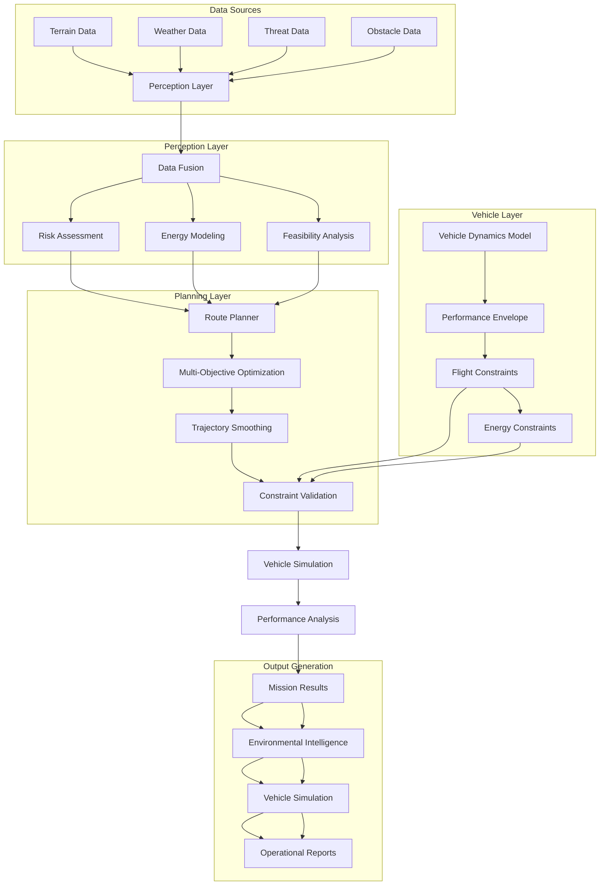
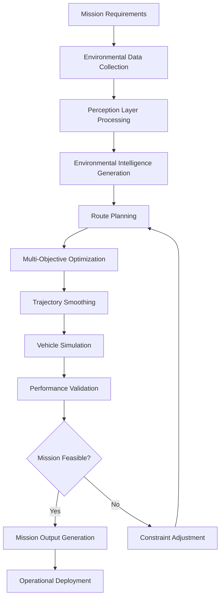
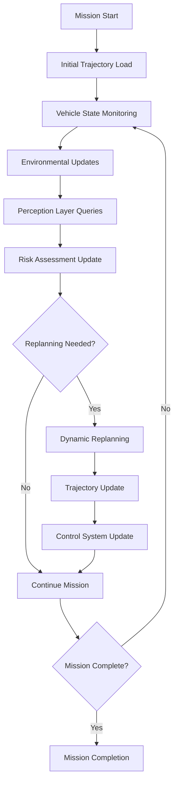

# eVTOL System Integration Comprehensive Report

## Executive Summary

This report provides a comprehensive analysis of how the three core layers of the eVTOL trajectory optimization system (Perception, Vehicle, and Planning) work together to create an integrated autonomous flight planning and execution platform. The system demonstrates sophisticated data flow, output utilization, and inter-layer communication that enables real-time mission planning, trajectory optimization, and vehicle simulation for defense-oriented eVTOL operations.

**Key Integration Capabilities:**
- **Planning Layer as Integration Hub**: The planning layer receives inputs from BOTH perception and vehicle layers to optimize trajectories
  - **Perception Layer Outputs**: Environmental intelligence (risk scores, energy costs, feasibility) for multi-objective route optimization
  - **Vehicle Layer Outputs**: Vehicle constraints (speed, altitude, turn radius, energy limits) for physical feasibility validation
- Real-time environmental intelligence feeding into trajectory optimization
- Multi-objective route planning with vehicle dynamics constraints
- Comprehensive output generation for operational deployment
- End-to-end workflow from environmental data to mission execution
- Robust error handling and fallback mechanisms across layers

---

## Table of Contents

1. [System Architecture Overview](#system-architecture-overview)
2. [Layer Integration Patterns](#layer-integration-patterns)
3. [Data Flow Architecture](#data-flow-architecture)
4. [Output Generation and Utilization](#output-generation-and-utilization)
5. [End-to-End Workflow](#end-to-end-workflow)
6. [Configuration Integration](#configuration-integration)
7. [API Integration and Communication](#api-integration-and-communication)
8. [Performance and Scalability](#performance-and-scalability)
9. [Error Handling and Resilience](#error-handling-and-resilience)
10. [Operational Deployment](#operational-deployment)

---

## System Architecture Overview

### High-Level Integration Architecture



### Layer Responsibilities and Interactions

| Layer | Primary Function | Input Sources | Output Consumers | Key Interfaces |
|-------|------------------|---------------|------------------|----------------|
| **Perception** | Environmental Intelligence | Raw geospatial data, sensors | Planning Layer | REST API, Direct calls |
| **Vehicle** | Vehicle Constraints & Dynamics | Vehicle specifications | Planning Layer, Mission execution | Flight envelope, constraints |
| **Planning** | Trajectory Optimization | **Perception data** (risk, energy, feasibility) + **Vehicle constraints** (envelope, performance limits) | Vehicle Layer, Control systems | Waypoint sequences, validated trajectories |

---

## Layer Integration Patterns

### 1. Perception → Planning Integration

**Data Flow Pattern**: Environmental intelligence feeds into trajectory optimization

**Key Integration Points**:
- **PerceptionClient**: Multi-mode interface (in-process, HTTP, fake)
- **Real-time Queries**: Point-based environmental data retrieval
- **Batch Processing**: Segment analysis for route optimization
- **Uncertainty Propagation**: Confidence-aware planning

**Data Structures**:
```python
@dataclass
class PerceptionResult:
    lat: float
    lon: float
    alt_m: float
    risk_score: float
    feasible: bool
    energy_cost_kwh_per_km: float
    terrain_slope_deg: Optional[float] = None
    terrain_roughness: Optional[float] = None
    wind_speed_ms: Optional[float] = None
    wind_direction_deg: Optional[float] = None
    threat_detection_prob: Optional[float] = None
    uncertainty: Optional[Dict[str, float]] = None
```

**Integration Implementation**:
```python
# Planning layer queries perception for route optimization
def _compute_edge_cost(self, from_wp: Waypoint, to_wp: Waypoint, time_iso: str) -> float:
    # Query perception layer
    result = self.perception.query(
        to_wp.lat, to_wp.lon, to_wp.alt_m, time_iso
    )
    
    # Check feasibility
    if not result.feasible:
        return -1.0
    
    # Multi-objective cost calculation
    distance_cost = distance_km
    energy_cost = result.energy_cost_kwh_per_km * distance_km
    risk_cost = result.risk_score * distance_km
    
    # Weighted combination
    total_cost = (
        self.cost_weights.get("distance", 0.3) * distance_cost +
        self.cost_weights.get("energy", 0.3) * energy_cost +
        self.cost_weights.get("risk", 0.3) * risk_cost +
        self.cost_weights.get("time", 0.1) * time_cost
    )
    
    return total_cost
```

### 2. Vehicle → Planning Integration

**Data Flow Pattern**: Vehicle constraints and performance limits inform trajectory optimization

**Key Integration Points**:
- **Flight Constraints**: Speed, altitude, turn radius, and performance limits
- **Energy Constraints**: Battery capacity and consumption rates
- **Validation During Planning**: Real-time constraint checking during optimization
- **Performance Envelope**: Vehicle capabilities that limit route selection

**Data Structures**:
```python
@dataclass
class VehicleConstraints:
    """Physical constraints for the eVTOL vehicle"""
    # Speed limits (m/s)
    min_speed_ms: float = 5.0
    max_speed_ms: float = 60.0
    cruise_speed_ms: float = 35.0
    
    # Acceleration limits (m/s²)
    max_acceleration_ms2: float = 3.0
    max_deceleration_ms2: float = 5.0
    
    # Turn performance
    max_bank_angle_deg: float = 45.0
    min_turn_radius_m: float = 50.0
    max_turn_rate_dps: float = 30.0  # deg/s
    
    # Vertical performance
    max_climb_rate_ms: float = 8.0
    max_descent_rate_ms: float = 6.0
    max_climb_angle_deg: float = 20.0
    max_descent_angle_deg: float = 15.0
    
    # Altitude limits (m)
    min_altitude_agl_m: float = 50.0
    max_altitude_asl_m: float = 5000.0
    service_ceiling_m: float = 4500.0
    
    # Payload constraints (kg)
    max_payload_kg: float = 600.0
    empty_weight_kg: float = 1500.0
    max_takeoff_weight_kg: float = 2100.0
    
    # Endurance limits
    max_flight_time_min: float = 60.0
    min_battery_reserve_percent: float = 20.0
```

**Integration Implementation**:
```python
class RoutePlanner:
    """A* route planner with vehicle constraints integration."""
    
    def __init__(self, config: PlanningConfig, vehicle_constraints: VehicleConstraints):
        self.config = config
        self.perception = PerceptionClient(config)
        self.vehicle_constraints = vehicle_constraints  # Vehicle constraints
        
    def _get_neighbors(self, waypoint: Waypoint, goal: Waypoint, constraints: Optional[dict]) -> List[Waypoint]:
        """Generate neighbor waypoints with vehicle constraint validation."""
        neighbors = []
        
        # 8-connected grid movements
        for dlat in [-1, 0, 1]:
            for dlon in [-1, 0, 1]:
                if dlat == 0 and dlon == 0:
                    continue
                
                new_lat = waypoint.lat + dlat * self.grid_resolution_deg
                new_lon = waypoint.lon + dlon * self.grid_resolution_deg
                
                # Consider altitude variations
                for dalt in [0]:  # Can add [-50, 0, 50] for 3D planning
                    new_alt = waypoint.alt_m + dalt
                    
                    # Apply vehicle constraints
                    if not self.vehicle_constraints.check_altitude_limits(waypoint.alt_m, new_alt):
                        continue
                    
                    # Apply additional constraints
                    if constraints:
                        min_alt = constraints.get("min_altitude_m", self.vehicle_constraints.min_altitude_agl_m)
                        max_alt = constraints.get("max_altitude_m", self.vehicle_constraints.max_altitude_asl_m)
                        if not (min_alt <= new_alt <= max_alt):
                            continue
                    
                    neighbors.append(Waypoint(new_lat, new_lon, new_alt))
        
        return neighbors
```

### 3. Planning → Vehicle Integration

**Data Flow Pattern**: Optimized trajectories feed into vehicle dynamics simulation

**Key Integration Points**:
- **Waypoint Sequences**: Structured trajectory data
- **Constraint Validation**: Flight envelope compliance
- **Energy Estimation**: Battery consumption modeling
- **Performance Metrics**: Flight characteristics analysis

**Data Structures**:
```python
@dataclass
class Waypoint:
    lat: float
    lon: float
    alt_m: float
    
@dataclass
class TrajectoryPoint:
    lat: float
    lon: float
    alt_m: float
    time_s: float
    speed_ms: Optional[float] = None
    curvature: Optional[float] = None
    heading_deg: Optional[float] = None
```

**Integration Implementation**:
```python
# Vehicle layer receives planned trajectory
def simulate_trajectory(self, waypoints: List[Waypoint], initial_state: VehicleState) -> List[VehicleState]:
    trajectory_states = []
    current_state = initial_state
    
    for i, waypoint in enumerate(waypoints):
        # Convert waypoint to vehicle state
        target_position = np.array([waypoint.lat, waypoint.lon, waypoint.alt_m])
        
        # Generate control inputs to reach waypoint
        controls = self.generate_controls(current_state, target_position)
        
        # Simulate vehicle dynamics
        next_state = self.integrate_dynamics(current_state, controls, self.time_step)
        
        trajectory_states.append(next_state)
        current_state = next_state
    
    return trajectory_states
```

### 3. Vehicle → Planning Feedback Integration

**Data Flow Pattern**: Vehicle performance data informs planning optimization

**Key Integration Points**:
- **Energy Consumption**: Actual vs. estimated energy usage
- **Performance Validation**: Constraint compliance verification
- **Dynamic Replanning**: Real-time trajectory updates
- **Fault Tolerance**: Failure mode analysis

**Integration Implementation**:
```python
# Planning layer receives vehicle feedback
def update_energy_model(self, actual_consumption: float, planned_consumption: float):
    """Update energy model based on actual vehicle performance."""
    error = actual_consumption - planned_consumption
    self.energy_model.update_correction_factor(error)
    
def validate_trajectory_feasibility(self, trajectory: List[TrajectoryPoint]) -> bool:
    """Validate trajectory against vehicle constraints."""
    for point in trajectory:
        if not self.vehicle_constraints.validate_point(point):
            return False
    return True
```

---

## Data Flow Architecture

### 1. Input Data Processing Pipeline


### 2. Real-Time Data Flow

**Perception Layer Processing**:
1. **Data Ingestion**: Multi-format geospatial data loading
2. **Transformation**: Coordinate system conversion, resampling
3. **Analysis**: Terrain, weather, threat assessment
4. **Fusion**: Multi-source data integration
5. **Output**: Structured environmental intelligence

**Planning Layer Processing**:
1. **Query Interface**: Perception data retrieval
2. **Pathfinding**: A* algorithm with multi-objective costs
3. **Optimization**: NSGA-III multi-objective optimization
4. **Smoothing**: Spline-based trajectory refinement
5. **Validation**: Constraint compliance checking

**Vehicle Layer Processing**:
1. **Trajectory Input**: Planned waypoint sequences
2. **Dynamics Simulation**: 6-DoF rigid body dynamics
3. **Control Generation**: Flight control system simulation
4. **Energy Modeling**: Battery consumption analysis
5. **Performance Output**: Flight characteristics and metrics

### 3. Batch Processing Workflow

**Mission Planning Workflow**:
```python
def plan_complete_mission(start_point, goal_point, mission_requirements):
    # 1. Environmental Analysis
    env_data = perception_layer.analyze_mission_area(
        start_point, goal_point, mission_requirements
    )
    
    # 2. Route Optimization
    routes = planning_layer.optimize_routes(
        start_point, goal_point, env_data, mission_requirements
    )
    
    # 3. Vehicle Simulation
    simulation_results = []
    for route in routes:
        vehicle_result = vehicle_layer.simulate_trajectory(
            route.waypoints, mission_requirements.initial_state
        )
        simulation_results.append(vehicle_result)
    
    # 4. Performance Analysis
    best_route = analyze_performance(simulation_results, mission_requirements)
    
    # 5. Output Generation
    mission_output = generate_mission_output(best_route, env_data, simulation_results)
    
    return mission_output
```

---

## Output Generation and Utilization

### 1. Environmental Intelligence Outputs

**Perception Layer Outputs**:

| Output Category | Format | Usage | Consumer |
|----------------|--------|-------|----------|
| **Terrain Analysis** | GeoTIFF, GeoJSON | Route planning, landing zones | Planning Layer, Operations |
| **Obstacle Detection** | GeoJSON, Shapefile | Safety assessment, clearance | Planning Layer, Control |
| **Weather Integration** | NetCDF, JSON | Performance modeling | Vehicle Layer, Planning |
| **Threat Assessment** | GeoTIFF, CSV | Risk evaluation | Planning Layer, Mission Planning |
| **Fused Intelligence** | GeoTIFF, JSON | Comprehensive analysis | All Layers, Decision Support |

**Key Output Files**:
```
outputs/environmental-intelligence/
├── terrain_analysis/
│   ├── digital_elevation_models/     # DEM data for route planning
│   ├── slope_aspect_maps/            # Terrain safety analysis
│   ├── roughness_analysis/          # Surface complexity
│   └── landing_zone_assessment/      # Safe landing areas
├── obstacle_detection/
│   ├── building_footprints/          # Urban obstacle data
│   ├── clearance_maps/              # Safe flight corridors
│   └── flight_safety_maps/          # Combined safety data
├── weather_integration/
│   ├── wind_field_maps/             # 3D wind data
│   ├── turbulence_models/           # Atmospheric turbulence
│   └── weather_impact_assessment/   # Performance effects
├── threat_assessment/
│   ├── radar_coverage_maps/         # Detection zones
│   ├── patrol_encounter_probability/ # Security analysis
│   └── electronic_warfare_zones/   # EW threat areas
└── fused_intelligence/
    ├── combined_risk_maps/          # Multi-source risk
    ├── feasibility_assessment/      # Mission viability
    └── uncertainty_quantification/  # Confidence analysis
```

### 2. Mission Results Outputs

**Planning Layer Outputs**:

| Output Category | Format | Usage | Consumer |
|----------------|--------|-------|----------|
| **Optimized Routes** | JSON, CSV, KML | Mission execution | Vehicle Layer, Pilots |
| **Route Metrics** | CSV, JSON | Performance analysis | Operations, Management |
| **Multi-Objective Results** | PNG, CSV, JSON | Decision support | Mission Planners |
| **Mission Planning** | JSON, YAML | Complete missions | Operations Teams |

**Key Output Files**:
```
outputs/mission-results/
├── route_optimization/
│   ├── optimized_routes/             # Mission-specific routes
│   ├── route_metrics/               # Performance metrics
│   └── visualizations/              # Route visualizations
├── multi_objective_optimization/
│   ├── pareto_frontiers/           # Trade-off analysis
│   ├── alternative_routes/         # K-best solutions
│   └── decision_support/           # Interactive tools
└── mission_planning/
    ├── complete_missions/           # End-to-end planning
    ├── waypoint_sequences/          # Navigation data
    └── mission_timelines/          # Temporal planning
```

### 3. Vehicle Simulation Outputs

**Vehicle Layer Outputs**:

| Output Category | Format | Usage | Consumer |
|----------------|--------|-------|----------|
| **Flight Dynamics** | CSV, JSON | Performance analysis | Engineers, Researchers |
| **Energy Management** | CSV, PNG | Battery analysis | Operations, Maintenance |
| **Control Systems** | CSV, JSON | Control analysis | Control Engineers |
| **Fault Analysis** | CSV, JSON | Reliability assessment | Safety Engineers |

**Key Output Files**:
```
outputs/vehicle-simulation/
├── flight_dynamics/
│   ├── state_evolution/            # Vehicle state over time
│   ├── control_inputs/              # Control commands
│   └── performance_metrics/        # Flight characteristics
├── energy_management/
│   ├── battery_analysis/           # Battery performance
│   ├── power_consumption/          # Energy usage
│   └── range_estimation/           # Flight range
├── control_systems/
│   ├── pid_controller_performance/ # Control system analysis
│   ├── stability_analysis/         # System stability
│   └── trajectory_tracking/        # Tracking performance
└── fault_analysis/
    ├── fault_injection_results/    # Failure mode analysis
    ├── recovery_assessment/         # Fault recovery
    └── reliability_metrics/        # System reliability
```

### 4. Output Utilization Patterns

**Operational Deployment**:
1. **Mission Planning**: Use optimized routes and environmental intelligence
2. **Pilot Briefing**: Waypoint sequences and mission timelines
3. **Real-time Operations**: Live environmental queries and dynamic replanning
4. **Post-mission Analysis**: Performance metrics and lessons learned

**Research and Development**:
1. **Algorithm Development**: Benchmarking data and performance metrics
2. **System Validation**: Integration test results and validation reports
3. **Performance Analysis**: Computational efficiency and accuracy assessment
4. **Capability Enhancement**: Feature development and optimization

---

## End-to-End Workflow

### 1. Complete Mission Planning Workflow



### 2. Real-Time Mission Execution Workflow



### 3. Data Transformation Pipeline

**Stage 1: Raw Data Processing**
```python
def process_raw_data(data_sources):
    """Process raw environmental data into structured formats."""
    processed_data = {}
    
    for source in data_sources:
        if source.type == "terrain":
            processed_data["terrain"] = load_raster_data(source.path)
        elif source.type == "weather":
            processed_data["weather"] = load_netcdf_data(source.path)
        elif source.type == "threats":
            processed_data["threats"] = load_vector_data(source.path)
    
    return processed_data
```

**Stage 2: Environmental Intelligence Generation**
```python
def generate_environmental_intelligence(processed_data):
    """Generate comprehensive environmental intelligence."""
    intelligence = {}
    
    # Terrain analysis
    intelligence["terrain"] = {
        "elevation": compute_elevation_features(processed_data["terrain"]),
        "slope": compute_slope(processed_data["terrain"]),
        "obstacles": detect_obstacles(processed_data["terrain"]),
        "landing_zones": analyze_landing_feasibility(processed_data["terrain"])
    }
    
    # Weather analysis
    intelligence["weather"] = {
        "wind_fields": model_wind_fields(processed_data["weather"]),
        "turbulence": estimate_turbulence(processed_data["weather"]),
        "air_density": compute_air_density(processed_data["weather"])
    }
    
    # Threat analysis
    intelligence["threats"] = {
        "radar_coverage": compute_radar_coverage(processed_data["threats"]),
        "patrol_routes": analyze_patrol_patterns(processed_data["threats"]),
        "ew_zones": assess_ew_coverage(processed_data["threats"])
    }
    
    # Data fusion
    intelligence["fused"] = fuse_intelligence_layers(intelligence)
    
    return intelligence
```

**Stage 3: Route Optimization**
```python
def optimize_routes(start_point, goal_point, intelligence):
    """Optimize routes using environmental intelligence."""
    # Initialize route planner
    planner = RoutePlanner(config)
    
    # Set up multi-objective optimization
    objectives = ["time", "energy", "risk", "feasibility"]
    optimizer = NSGA3Optimizer(objectives, constraints)
    
    # Generate initial population
    initial_routes = generate_initial_routes(start_point, goal_point, intelligence)
    
    # Run optimization
    optimized_routes = optimizer.optimize(initial_routes)
    
    # Smooth trajectories
    smoothed_routes = []
    for route in optimized_routes:
        smoothed = spline_smoother.smooth_waypoints(route.waypoints)
        smoothed_routes.append(smoothed)
    
    return smoothed_routes
```

**Stage 4: Vehicle Simulation**
```python
def simulate_vehicle_performance(routes, vehicle_config):
    """Simulate vehicle performance for each route."""
    vehicle = VehicleModel(vehicle_config)
    simulation_results = []
    
    for route in routes:
        # Set initial state
        initial_state = VehicleState(
            position=np.array([route.start.lat, route.start.lon, route.start.alt]),
            velocity=np.array([0.0, 0.0, 0.0]),
            attitude=np.array([0.0, 0.0, 0.0]),
            battery_soc=0.8
        )
        
        # Simulate trajectory
        trajectory = vehicle.simulate_trajectory(route.waypoints, initial_state)
        
        # Analyze performance
        performance = analyze_trajectory_performance(trajectory, route)
        
        simulation_results.append({
            "route": route,
            "trajectory": trajectory,
            "performance": performance
        })
    
    return simulation_results
```

---

## Configuration Integration

### 1. Unified Configuration Management

**System-wide Configuration**:
```yaml
# config/default.yaml
system:
  debug: false
  log_level: "INFO"
  max_workers: 4

# Perception layer configuration
perception:
  terrain:
    resolution: 1.0  # meters
    max_height: 1000.0  # meters
    interpolation_method: "bilinear"
  weather:
    update_interval: 300  # seconds
    forecast_hours: 24
  threats:
    detection_range: 5000.0  # meters
    update_frequency: 1.0  # Hz
  fusion:
    confidence_threshold: 0.7
    max_age: 30.0  # seconds

# Planning layer configuration
planning:
  routing:
    algorithm: "astar"
    heuristic: "euclidean"
    max_iterations: 10000
  optimization:
    max_iterations: 1000
    convergence_tolerance: 1e-6
    population_size: 50
  constraints:
    max_altitude: 1000.0  # meters
    min_altitude: 10.0  # meters
    max_speed: 50.0  # m/s
    max_acceleration: 5.0  # m/s²

# Vehicle layer configuration
vehicle:
  dynamics:
    integration_method: "rk4"
    time_step: 0.01  # seconds
    max_simulation_time: 3600.0  # seconds
  energy:
    battery_capacity: 100.0  # kWh
    charging_efficiency: 0.9
    discharge_efficiency: 0.95
  constraints:
    max_payload: 100.0  # kg
    max_flight_time: 3600.0  # seconds
```

### 2. Configuration Propagation

**Configuration Flow**:
```python
def setup_integrated_system(config_path):
    """Setup integrated system with shared configuration."""
    # Load system configuration
    system_config = load_config(config_path)
    
    # Initialize perception layer
    perception_config = system_config["perception"]
    perception_layer = PerceptionLayer(perception_config)
    
    # Initialize planning layer
    planning_config = system_config["planning"]
    planning_layer = PlanningLayer(planning_config)
    
    # Initialize vehicle layer
    vehicle_config = system_config["vehicle"]
    vehicle_layer = VehicleLayer(vehicle_config)
    
    # Setup inter-layer communication
    planning_layer.set_perception_client(perception_layer.get_client())
    vehicle_layer.set_planning_interface(planning_layer.get_interface())
    
    return {
        "perception": perception_layer,
        "planning": planning_layer,
        "vehicle": vehicle_layer
    }
```

---

## API Integration and Communication

### 1. REST API Architecture

**Perception Layer API**:
```python
# FastAPI server for perception layer
app = FastAPI(
    title="eVTOL Perception Layer API",
    description="Real-time perception data for eVTOL trajectory optimization",
    version="0.1.0"
)

@app.post("/api/v1/query")
async def query_point(query: PointQuery):
    """Query environmental data for a single point."""
    result = perception_layer.query(
        query.lat, query.lon, query.alt_m, query.time_iso
    )
    return PerceptionResponse(
        risk_score=result.risk_score,
        feasible=result.feasible,
        energy_cost_kwh_per_km=result.energy_cost_kwh_per_km,
        uncertainty=result.uncertainty
    )

@app.post("/api/v1/batch_query")
async def batch_query(points: List[PointQuery]):
    """Query environmental data for multiple points."""
    results = perception_layer.batch_query(points)
    return [PerceptionResponse.from_result(r) for r in results]

@app.get("/api/v1/health")
async def health_check():
    """Health check endpoint."""
    return {"status": "healthy", "timestamp": datetime.now().isoformat()}
```

**Planning Layer API**:
```python
@app.post("/api/v1/plan_route")
async def plan_route(request: RouteRequest):
    """Plan optimal route between two points."""
    route = planning_layer.optimize_route(
        request.start_lat, request.start_lon,
        request.goal_lat, request.goal_lon,
        request.start_alt_m, request.time_iso
    )
    return RouteResponse(
        waypoints=[WaypointResponse.from_waypoint(wp) for wp in route],
        total_distance=compute_total_distance(route),
        estimated_energy=estimate_route_energy(route),
        estimated_time=estimate_route_time(route)
    )
```

### 2. Inter-Layer Communication

**PerceptionClient Implementation**:
```python
class PerceptionClient:
    """Client for querying perception layer data."""
    
    def __init__(self, config, api_endpoint=None, use_http=False, use_fake=False):
        self.api_endpoint = api_endpoint
        self.use_http = use_http
        self.use_fake = use_fake
        
        # Try local import first
        if not use_http:
            try:
                from perception.serving.api import QueryPoint, risk_score, feasible, energy_cost_kwh_per_km
                self._risk_score = risk_score
                self._feasible = feasible
                self._energy_cost = energy_cost_kwh_per_km
                self.perception_available = True
            except ImportError:
                self.use_fake = True
    
    def query(self, lat: float, lon: float, alt_m: float, time_iso: str) -> PerceptionResult:
        """Query perception data for a single point."""
        if self.use_http:
            return self._query_http(lat, lon, alt_m, time_iso)
        elif self.perception_available:
            return self._query_local(lat, lon, alt_m, time_iso)
        else:
            return self._query_fake(lat, lon, alt_m, time_iso)
```

### 3. Data Serialization and Formats

**Standard Data Formats**:
- **JSON**: Structured data exchange between layers
- **CSV**: Tabular data for analysis and visualization
- **GeoTIFF**: Geospatial raster data
- **GeoJSON**: Geospatial vector data
- **NetCDF**: Scientific atmospheric data
- **HDF5**: Large-scale numerical data

**Data Serialization Example**:
```python
class WaypointSerializer:
    """Serialize waypoints for inter-layer communication."""
    
    @staticmethod
    def to_dict(waypoint: Waypoint) -> Dict[str, Any]:
        return {
            "lat": waypoint.lat,
            "lon": waypoint.lon,
            "alt_m": waypoint.alt_m,
            "timestamp": waypoint.timestamp.isoformat() if hasattr(waypoint, 'timestamp') else None
        }
    
    @staticmethod
    def from_dict(data: Dict[str, Any]) -> Waypoint:
        return Waypoint(
            lat=data["lat"],
            lon=data["lon"],
            alt_m=data["alt_m"]
        )
```

---

## Performance and Scalability

### 1. Computational Performance

**Layer Performance Characteristics**:

| Layer | Operation | Time Complexity | Space Complexity | Typical Performance |
|-------|-----------|----------------|------------------|-------------------|
| **Perception** | Point Query | O(1) | O(n) | <1ms per query |
| **Perception** | Batch Query | O(m) | O(n) | <10ms for 100 points |
| **Perception** | Data Fusion | O(n²) | O(n²) | <1s for 1km² area |
| **Planning** | A* Search | O(b^d) | O(b^d) | <100ms for 10km route |
| **Planning** | NSGA-III | O(MN²) | O(N) | <10s for 100 generations |
| **Vehicle** | Dynamics | O(n) | O(1) | <1ms per timestep |
| **Vehicle** | Trajectory | O(n) | O(n) | <100ms for 1000 points |

**Performance Optimization Strategies**:
1. **Caching**: Perception query results caching
2. **Parallel Processing**: Multi-threaded route generation
3. **Grid Discretization**: Configurable resolution for speed/accuracy trade-off
4. **Early Termination**: Constraint violation detection
5. **Heuristic Optimization**: Admissible heuristics for A*

### 2. Memory Management

**Memory Usage Patterns**:
```python
class MemoryManager:
    """Manage memory usage across layers."""
    
    def __init__(self, max_memory_gb: float = 8.0):
        self.max_memory = max_memory_gb * 1024**3  # Convert to bytes
        self.current_usage = 0
        self.cache = {}
    
    def cache_perception_data(self, key: str, data: Any):
        """Cache perception data with memory management."""
        data_size = self._estimate_size(data)
        
        if self.current_usage + data_size > self.max_memory:
            self._evict_oldest_cache()
        
        self.cache[key] = {
            "data": data,
            "timestamp": time.time(),
            "size": data_size
        }
        self.current_usage += data_size
    
    def _evict_oldest_cache(self):
        """Evict oldest cached data."""
        oldest_key = min(self.cache.keys(), key=lambda k: self.cache[k]["timestamp"])
        evicted_size = self.cache[oldest_key]["size"]
        del self.cache[oldest_key]
        self.current_usage -= evicted_size
```

### 3. Scalability Considerations

**Horizontal Scaling**:
- **Microservices Architecture**: Each layer as independent service
- **Load Balancing**: Distribute requests across multiple instances
- **Database Sharding**: Partition geospatial data by region
- **Caching Layers**: Redis/Memcached for frequently accessed data

**Vertical Scaling**:
- **Multi-core Processing**: Parallel computation within layers
- **GPU Acceleration**: CUDA for large-scale geospatial processing
- **Memory Optimization**: Efficient data structures and algorithms
- **Storage Optimization**: Compressed data formats and lazy loading

---

## Error Handling and Resilience

### 1. Error Propagation and Handling

**Error Types and Handling**:

| Error Type | Layer | Handling Strategy | Fallback Mechanism |
|------------|-------|------------------|-------------------|
| **Data Unavailable** | Perception | Retry with exponential backoff | Use cached/default data |
| **No Path Found** | Planning | Increase search resolution | Straight-line fallback |
| **Constraint Violation** | Vehicle | Adjust trajectory | Emergency procedures |
| **API Timeout** | All | Circuit breaker pattern | Local processing mode |
| **Memory Overflow** | All | Garbage collection | Data compression |

**Error Handling Implementation**:
```python
class ErrorHandler:
    """Centralized error handling for integrated system."""
    
    def __init__(self):
        self.retry_config = {
            "max_retries": 3,
            "base_delay": 1.0,
            "max_delay": 60.0,
            "exponential_base": 2.0
        }
    
    def handle_perception_error(self, error: Exception, context: Dict[str, Any]) -> Any:
        """Handle perception layer errors."""
        if isinstance(error, DataIngestionError):
            return self._handle_data_error(error, context)
        elif isinstance(error, APIError):
            return self._handle_api_error(error, context)
        else:
            return self._handle_generic_error(error, context)
    
    def _handle_data_error(self, error: DataIngestionError, context: Dict[str, Any]) -> Any:
        """Handle data-related errors."""
        # Try alternative data sources
        alternative_sources = context.get("alternative_sources", [])
        for source in alternative_sources:
            try:
                return self._load_alternative_data(source)
            except Exception:
                continue
        
        # Use default/fallback data
        return self._get_default_data(context["data_type"])
```

### 2. Resilience Patterns

**Circuit Breaker Pattern**:
```python
class CircuitBreaker:
    """Circuit breaker for external service calls."""
    
    def __init__(self, failure_threshold: int = 5, timeout: float = 60.0):
        self.failure_threshold = failure_threshold
        self.timeout = timeout
        self.failure_count = 0
        self.last_failure_time = None
        self.state = "CLOSED"  # CLOSED, OPEN, HALF_OPEN
    
    def call(self, func, *args, **kwargs):
        """Execute function with circuit breaker protection."""
        if self.state == "OPEN":
            if time.time() - self.last_failure_time > self.timeout:
                self.state = "HALF_OPEN"
            else:
                raise CircuitBreakerOpenError("Circuit breaker is OPEN")
        
        try:
            result = func(*args, **kwargs)
            if self.state == "HALF_OPEN":
                self.state = "CLOSED"
                self.failure_count = 0
            return result
        except Exception as e:
            self.failure_count += 1
            self.last_failure_time = time.time()
            
            if self.failure_count >= self.failure_threshold:
                self.state = "OPEN"
            
            raise e
```

**Graceful Degradation**:
```python
class GracefulDegradation:
    """Implement graceful degradation for system resilience."""
    
    def __init__(self):
        self.degradation_levels = {
            "full": 1.0,      # All features available
            "reduced": 0.7,   # Reduced functionality
            "minimal": 0.3,   # Minimal functionality
            "offline": 0.0    # Offline mode
        }
        self.current_level = "full"
    
    def degrade_perception_layer(self, error: Exception):
        """Degrade perception layer functionality."""
        if isinstance(error, APIError):
            self.current_level = "reduced"
            # Use cached data and simplified models
        elif isinstance(error, DataError):
            self.current_level = "minimal"
            # Use default environmental assumptions
        else:
            self.current_level = "offline"
            # Use static environmental data
    
    def adapt_planning_layer(self, degradation_level: str):
        """Adapt planning layer to degradation level."""
        if degradation_level == "reduced":
            # Use simplified optimization
            return SimplifiedRoutePlanner()
        elif degradation_level == "minimal":
            # Use basic pathfinding
            return BasicRoutePlanner()
        else:
            # Use offline planning
            return OfflineRoutePlanner()
```

---

## Operational Deployment

### 1. Deployment Architecture

**Production Deployment**:
```yaml
# docker-compose.yml
version: '3.8'
services:
  perception-layer:
    image: evtol/perception:latest
    ports:
      - "8000:8000"
    environment:
      - CONFIG_PATH=/app/config/production.yaml
      - LOG_LEVEL=INFO
    volumes:
      - ./data:/app/data
      - ./config:/app/config
    deploy:
      replicas: 2
      resources:
        limits:
          memory: 4G
          cpus: '2'
  
  planning-layer:
    image: evtol/planning:latest
    ports:
      - "8001:8001"
    environment:
      - PERCEPTION_API_URL=http://perception-layer:8000
      - CONFIG_PATH=/app/config/production.yaml
    depends_on:
      - perception-layer
    deploy:
      replicas: 2
      resources:
        limits:
          memory: 2G
          cpus: '1'
  
  vehicle-layer:
    image: evtol/vehicle:latest
    ports:
      - "8002:8002"
    environment:
      - PLANNING_API_URL=http://planning-layer:8001
      - CONFIG_PATH=/app/config/production.yaml
    depends_on:
      - planning-layer
    deploy:
      replicas: 1
      resources:
        limits:
          memory: 1G
          cpus: '0.5'
  
  nginx:
    image: nginx:alpine
    ports:
      - "80:80"
      - "443:443"
    volumes:
      - ./nginx.conf:/etc/nginx/nginx.conf
    depends_on:
      - perception-layer
      - planning-layer
      - vehicle-layer
```

### 2. Monitoring and Observability

**System Monitoring**:
```python
class SystemMonitor:
    """Monitor integrated system performance."""
    
    def __init__(self):
        self.metrics = {
            "perception": {
                "query_latency": [],
                "cache_hit_rate": 0.0,
                "error_rate": 0.0
            },
            "planning": {
                "route_generation_time": [],
                "optimization_iterations": [],
                "success_rate": 0.0
            },
            "vehicle": {
                "simulation_time": [],
                "energy_accuracy": 0.0,
                "constraint_violations": 0
            }
        }
    
    def record_perception_metrics(self, query_time: float, cache_hit: bool, error: bool):
        """Record perception layer metrics."""
        self.metrics["perception"]["query_latency"].append(query_time)
        if cache_hit:
            self.metrics["perception"]["cache_hit_rate"] += 1
        if error:
            self.metrics["perception"]["error_rate"] += 1
    
    def record_planning_metrics(self, generation_time: float, iterations: int, success: bool):
        """Record planning layer metrics."""
        self.metrics["planning"]["route_generation_time"].append(generation_time)
        self.metrics["planning"]["optimization_iterations"].append(iterations)
        if success:
            self.metrics["planning"]["success_rate"] += 1
    
    def get_system_health(self) -> Dict[str, Any]:
        """Get overall system health status."""
        health = {
            "overall_status": "healthy",
            "layer_status": {},
            "performance_metrics": {},
            "recommendations": []
        }
        
        # Check perception layer health
        avg_latency = np.mean(self.metrics["perception"]["query_latency"])
        if avg_latency > 1.0:  # >1 second
            health["layer_status"]["perception"] = "degraded"
            health["recommendations"].append("Consider increasing perception layer resources")
        
        # Check planning layer health
        success_rate = self.metrics["planning"]["success_rate"]
        if success_rate < 0.9:  # <90% success rate
            health["layer_status"]["planning"] = "degraded"
            health["recommendations"].append("Review planning constraints and parameters")
        
        return health
```

### 3. Output Management and Archival

**Output Lifecycle Management**:
```python
class OutputManager:
    """Manage output generation, storage, and archival."""
    
    def __init__(self, storage_config: Dict[str, Any]):
        self.storage_config = storage_config
        self.output_retention = {
            "mission_results": 365,  # days
            "environmental_intelligence": 90,
            "vehicle_simulation": 180,
            "benchmarking": 730
        }
    
    def generate_mission_output(self, mission_data: Dict[str, Any]) -> str:
        """Generate comprehensive mission output."""
        output_id = self._generate_output_id()
        output_path = self._create_output_directory(output_id)
        
        # Generate environmental intelligence summary
        env_summary = self._generate_environmental_summary(mission_data["environmental"])
        self._save_output(output_path / "environmental_intelligence.json", env_summary)
        
        # Generate route optimization results
        route_results = self._generate_route_results(mission_data["routes"])
        self._save_output(output_path / "route_optimization.json", route_results)
        
        # Generate vehicle simulation results
        vehicle_results = self._generate_vehicle_results(mission_data["simulation"])
        self._save_output(output_path / "vehicle_simulation.json", vehicle_results)
        
        # Generate integrated mission report
        mission_report = self._generate_mission_report(mission_data)
        self._save_output(output_path / "mission_report.pdf", mission_report)
        
        # Archive outputs
        self._archive_output(output_id, output_path)
        
        return output_id
    
    def _archive_output(self, output_id: str, output_path: Path):
        """Archive output for long-term storage."""
        archive_config = self.storage_config["archive"]
        
        if archive_config["enabled"]:
            # Compress output directory
            archive_file = f"{output_id}.tar.gz"
            with tarfile.open(archive_file, "w:gz") as tar:
                tar.add(output_path, arcname=output_id)
            
            # Upload to cloud storage
            self._upload_to_cloud_storage(archive_file, archive_config["bucket"])
            
            # Update metadata
            self._update_output_metadata(output_id, {
                "archived": True,
                "archive_location": archive_config["bucket"],
                "archive_date": datetime.now().isoformat()
            })
```

---

## Conclusion

The eVTOL trajectory optimization system demonstrates sophisticated integration between perception, planning, and vehicle layers, creating a comprehensive autonomous flight planning platform. The system's strength lies in its:

### **Key Integration Achievements**:

1. **Seamless Data Flow**: Real-time environmental intelligence feeds into trajectory optimization, which guides vehicle simulation
2. **Multi-Modal Communication**: REST APIs, direct function calls, and data serialization enable flexible inter-layer communication
3. **Comprehensive Output Generation**: Structured outputs support both operational deployment and research/development activities
4. **Robust Error Handling**: Graceful degradation and fallback mechanisms ensure system resilience
5. **Scalable Architecture**: Microservices design enables horizontal scaling and independent layer deployment

### **Operational Value**:

- **Mission Planning**: Complete end-to-end mission planning from environmental analysis to vehicle simulation
- **Real-time Operations**: Live environmental queries and dynamic replanning capabilities
- **Decision Support**: Multi-objective optimization provides trade-off analysis for complex decisions
- **Performance Analysis**: Comprehensive metrics and benchmarking support continuous improvement
- **Research Platform**: Extensive data exports and analysis tools enable algorithm development

### **Future Enhancement Opportunities**:

1. **Machine Learning Integration**: AI-driven optimization and adaptive parameter tuning
2. **Real-time Collaboration**: Multi-vehicle coordination and swarm optimization
3. **Advanced Uncertainty Handling**: Bayesian optimization and robust decision-making
4. **Human-AI Collaboration**: Interactive planning interfaces and explainable AI
5. **Edge Computing**: Distributed processing for real-time mission execution

The integrated system provides a solid foundation for autonomous eVTOL operations in defense applications, with the flexibility to adapt to evolving requirements and technological advances.

---

**Document Version**: 1.0  
**Last Updated**: December 2024  
**Author**: eVTOL Defense System Integration Team  
**Contact**: integration@evtol-defense.com
